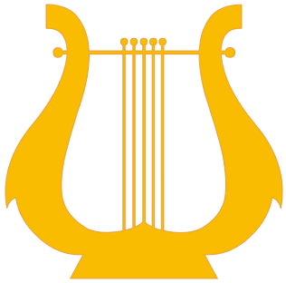

<section class="link_container">

<section class="link_box special projects"><h2 class="page_title_text">ThingLearn</h2><h3>ThingLearn is a suite of projects designed to teach kids about the Internet of Things in a fun, interactive, hands-on way. Build things and learn the science behind them!</h3><a class="project_button" href="http://www.thinglearn.com">Learn more</a></section>

<section class="link_box special projects"><h2 class="page_title_text">Snappy Squirrel E-Books</h2><h3>Learn about personal finance by reading stories and playing games about a little squirrel who is saving to build a new nest. Educational fun for the whole family!</h3><a class="project_button" href="/lfm/snappy">Learn more</a></section>

<!--row 2-->

<section class="link_box special projects"><h2 class="page_title_text">Practice Buddy App</h2><h3>Practice Buddy is a mobile app for music teachers and students. Login and track your practicing progress; teachers, monitor and incentivize your students.</h3><a class="project_button" href="http://www.practicebuddyapp.com">Learn more</a></section>

<section class="link_box special projects"><h2 class="page_title_text">NativeScript Snacks</h2><h3>NativeScript Snacks are a fun way to learn about NativeScript via community-built videos, snippets, and Snacklabs, a kind of Codelab.</h3><a class="project_button" href="http://www.nativescriptsnacks.com">Learn more</a></section>

</section>
    